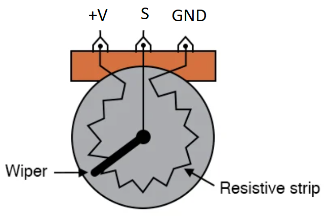

# servo_tester
simple example program to control some servos with potentiometers

## Wiring
The example code allows three potentiometers (wired to Analog ping 0, 1, 2) to directly
control the position of three servos (wired to DIO pins 9, 10, 11) respectively. If its
more convenient to use a different set of pins on your board, go for it.

### Potentiometer
Pretty much any potentiometer should work (1k, 10k, etc), wire it up so that:
  * the signal pin, S, connects to the appropriate DIO pin (defined at the top of the arduino sketch)
  * the ground pin connects to the same GND reference as the arduino ground
  * the +V pin conencts to the voltage rail on an Uno or Mega this would be 5VDC. If you aren't sure,
    verify that the Analog input pins on your arduino are 5V compliant



You should adjust the following lines in the [arduino sketch](servo_tester/servo_tester.ino) to match the range of values you expect
to read 
  ```c
  #define MIN_ANALOG_VAL 0
  #define MAX_ANALOG_VAL 1023
  ```

### Servos

This was tested using MG 996R 180 degree servos. Any should work, but you may need to adjust the upper
and lower ranges, in the [arduino sketch](servo_tester/servo_tester.ino), for your particular servo hardware.

  ```c
  #define MIN_SERVO_DEGREES 0
  #define MAX_SERVO_DEGREES 180
  ```

Some will try to fight their position when near end of travel (you'll hear it),
some will move only 90 degrees of 360 degrees. The value sent doesn't directly map to a physical
rotational position, but instead a duty cycle of the PWM signal.
